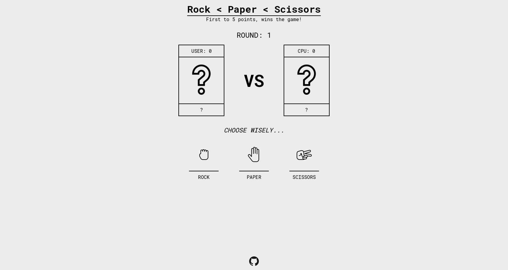

# Rock, paper, scissors - Odin project
[Rock, paper, scissors](https://en.wikipedia.org/wiki/Rock_paper_scissors) game implemented in JavaScript with a simple graphical user interface. This project was an assignment from [Odin's Foundations path](https://www.theodinproject.com/paths/foundations/courses/foundations/lessons/rock-paper-scissors).

## Screenshots

### Desktop

### Mobile

## Demo

## Credits

- [Hand Rock](https://icons8.com/icon/44378/hand-rock) icon by [Icons8](https://icons8.com)

- [Hand Paper](https://icons8.com/icon/2727/hand) icon by [Icons8](https://icons8.com)

- [Hand Scissors](https://icons8.com/icon/44376/hand-scissors) icon by [Icons8](https://icons8.com)

- [Question Mark](https://www.flaticon.com/free-icon/question_2476199) icon by [Freepik](https://freepik.com) from [Flaticon](https://flaticon.com)

- [Win](https://www.flaticon.com/premium-icon/win_5215607) icon by [Freepik](https://freepik.com) from [Flaticon](https://flaticon.com)

- [Game over](https://www.flaticon.com/free-icon/game-over_5218954) icon by [Good Ware](https://www.flaticon.com/authors/good-ware) from [Flaticon](https://flaticon.com)
